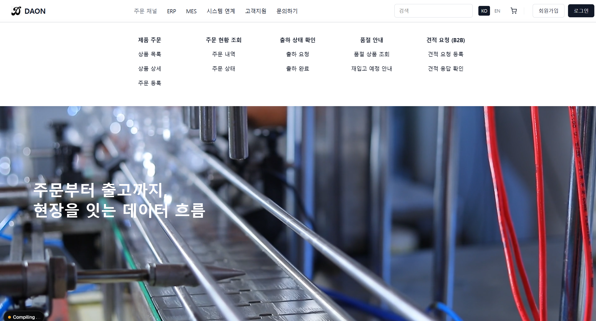
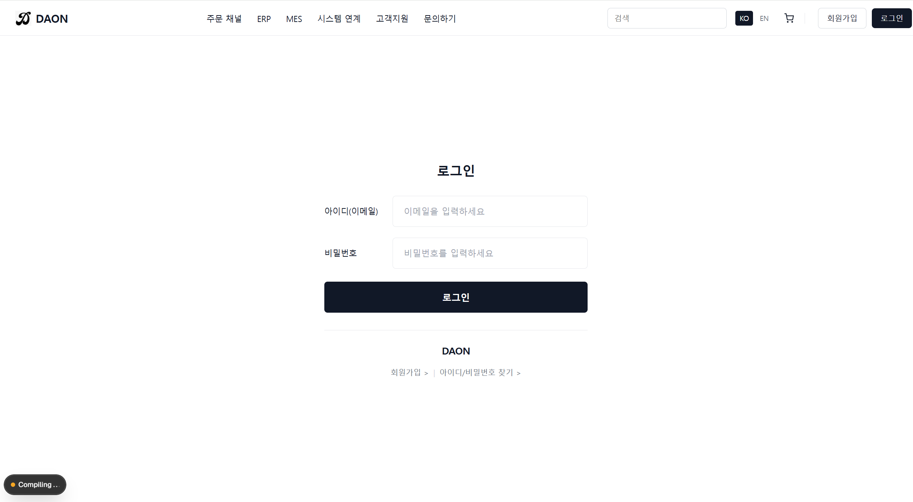
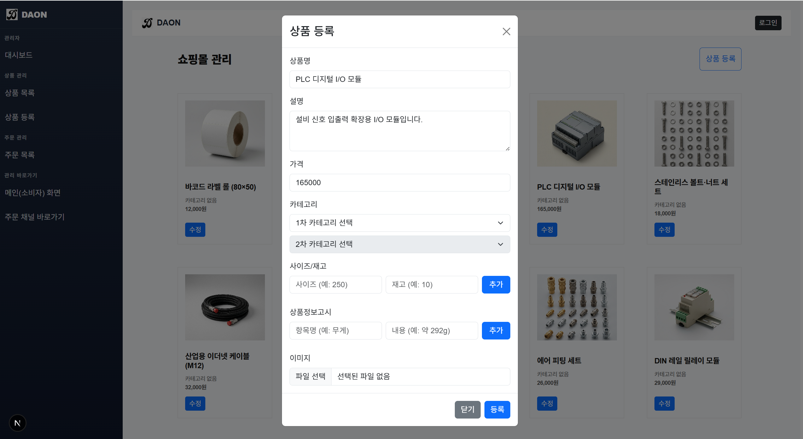

# 🏭 ERP · MES 연계 B2B 쇼핑몰 프론트엔드 프로젝트

본 프로젝트는 **ERP·MES 업무 흐름을 고려한 B2B 산업자재 쇼핑몰 프론트엔드 웹 애플리케이션**입니다.  

단순 상품 판매가 아닌,  

**기준정보 → 주문 → 재고 → 출고 → 매출**로 이어지는 기업용 시스템 흐름을 화면 구조와 UI 관점에서 설계·구현하는 것을 목표로 합니다.

> ⚠️ 현재 기능 확장 및 ERP·MES 연계 고도화 **진행중**인 개인 포트폴리오 프로젝트입니다.

---

## 📌 프로젝트 개요

본 쇼핑몰은 단독 서비스가 아닌,  
**ERP(기준정보) · MES(재고/출고) · SHOP(주문 채널)** 이 유기적으로 연결되는 구조를 전제로 설계되었습니다.

### 🔗 역할 분리
- **ERP**
  - 상품 / 가격 / 카테고리 기준정보 관리
  - 주문 관리 및 출하·매출 처리
- **SHOP**
  - 상품 조회
  - 주문 접수
  - 주문 및 출하 상태 확인
- **MES**
  - 재고 흐름 관리
  - 출고 및 생산 연계 확장을 고려한 구조

> 현재는 SHOP 중심의 프론트엔드 구현 단계이며,  
> 향후 MES 재고 차감 및 출고 연계 기능을 단계적으로 확장할 예정입니다.

---

## 🏭 메인 화면 (B2B 쇼핑몰 진입)

ERP·MES와 연결되는 **업무 흐름의 시작 지점**으로, 주문부터 출고까지 이어지는 전체 흐름을 시각적으로 표현한 메인 화면입니다.

### 주요 특징
- 카드형 상품 리스트 UI
- ERP 기준 상품명 및 가격 정보 노출
- 주문 흐름의 시작 지점 역할 수행
- 제조·유통 기업용 쇼핑몰 톤앤매너 반영

---

## 🔐 로그인 화면

관리자 / 사용자 계정을 분리하여  
**권한(Role) 기반 화면 접근**을 고려한 로그인 화면입니다.

- ERP·MES·SHOP 공통 인증 흐름 고려
- 기업용 시스템에 맞춘 간결한 UI
- 권한에 따른 메뉴 접근 제어 구조 설계

---

## 🧑‍💼 관리자 화면 (ERP 성격)

상품 마스터를 관리하는 관리자 화면으로,  
ERP 기준 정보 관리 역할을 수행합니다.

### 관리 기능
- 상품 마스터 등록 / 수정 / 삭제
- 판매중 / 품절 상태 관리
- 카드형 UI 기반 상품 관리 화면

---

## 🔁 업무 흐름 요약 (ERP · MES · SHOP)

1. 사용자가 쇼핑몰에서 상품 주문
2. ERP에서 주문 접수 및 재고 확인
3. 재고 부족 시 MES로 생산 지시 (확장 예정)
4. MES 생산 완료 후 ERP 재고 반영
5. ERP 출하 처리 → 쇼핑몰 출하 상태 노출

---

## 🛠 기술 스택

### Frontend
- Next.js (App Router)
- React 18
- TypeScript

### UI / Styling
- Styled-components
- 카드형 UI 중심 화면 구성

### Backend (연계 예정)
- Spring Boot
- JPA
- REST API

### DB (연계 예정)
- RDB 기반 설계

---

## 🎯 프로젝트 목적

- 단순 CRUD 쇼핑몰이 아닌  
  **ERP·MES 업무 흐름을 고려한 시스템 구조 설계 경험**
- 기준정보 → 주문 → 재고 → 출고로 이어지는  
  **현업 중심 사고 방식 강화**
- 스마트팩토리 / 제조 IT 도메인 확장을 위한 포트폴리오 구축

---

## 👨‍💻 Developer

**이기창**  
ERP · MES · B2B Commerce 기반 웹 서비스 개발  
Next.js · React(TypeScript) · Spring Boot

> 단순 화면 구현이 아닌,  
> **현업 업무 흐름을 이해하고 시스템으로 구조화하는 개발자**를 지향합니다.
